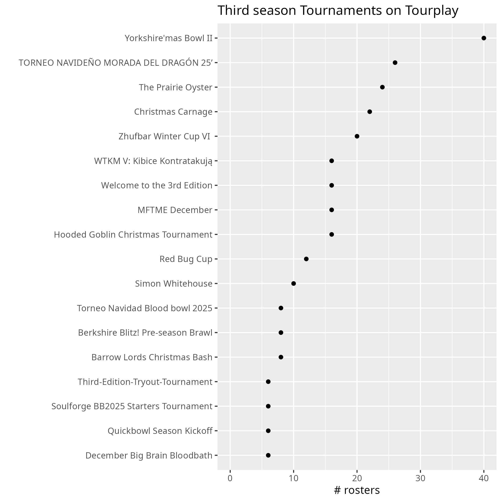
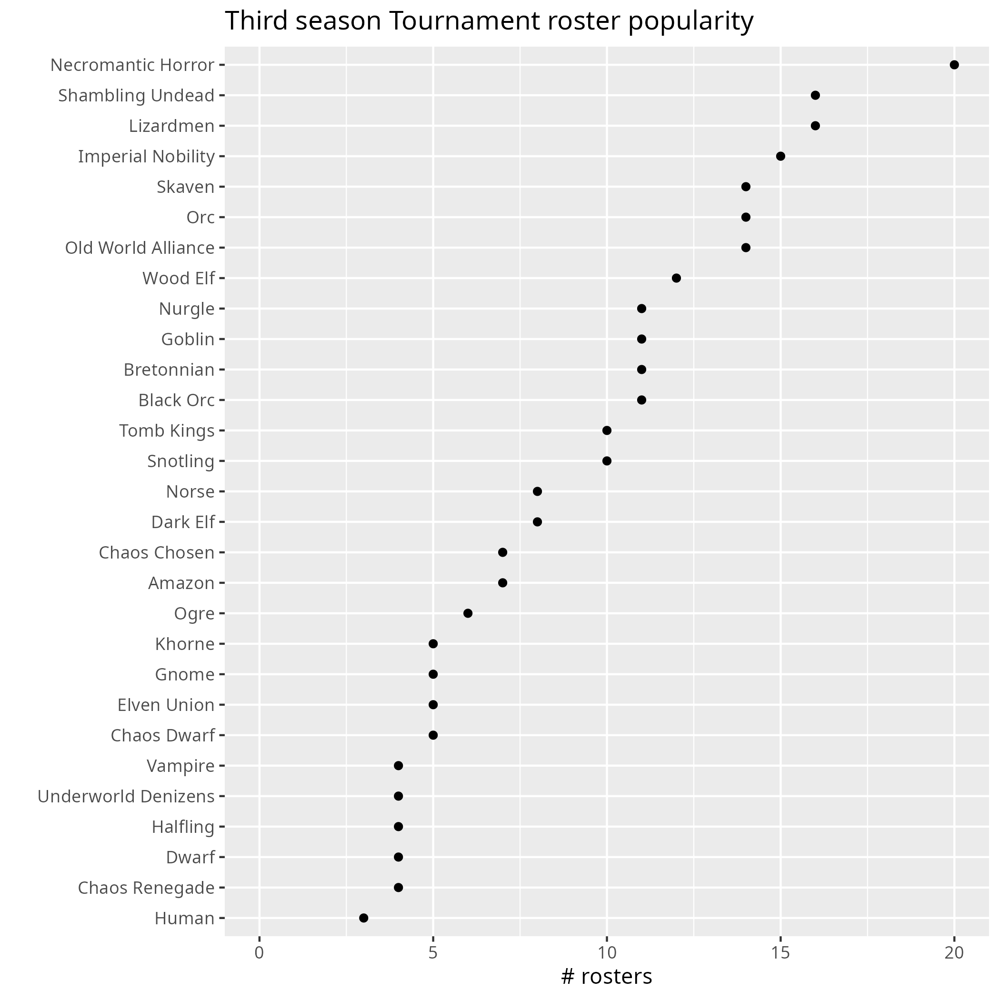

Blood Bowl Third Season (aka BB2025) is here! 

In this post, I look at tournament data from Tourplay and NAF to check what teams are popular in BB2025.

# A new edition of Blood Bowl
So what does BB2025 bring? A completely new team (**Bretonnian**), and lots of (small) changes, while keeping the core of the game intact.
The NAF already documented (and sometimes clarified) a long list of [changes](https://www.thenaf.net/naf-recommendations-and-clarifications-for-bb2025/). At the time of writing, 214 issues have been identified!
They made a great [summary](https://www.thenaf.net/wp-content/uploads/2026/01/NAF-FAQ-for-BB2025_v20260115_A4.pdf) of the most important changes and clarifications.

For a nice overview of changes per team / roster, check out the website of nazgob at https://2025.nazgob.co.uk/teams

# The first tournaments using BB2025 rules

Currently there are two main data sources with BB2025 games: The NAF database and Tourplay.
The nice thing about Tourplay is that it contains the actual rosters as well. Here we only look at team choice, in a later blog post we zoom in on the actual rosters.
As the Tourplay data underlying this post was scraped end of december 2025, we are looking at really the first few weeks of BB2025 tournament play.
The data largely consist of small scale local tournaments, with 10-20 coaches, and were not NAF approved.
The biggest tournament was a UK tournament called  "Yorkshire'mas Bowl II" , which was NAF registered, and used tiering.

Here is an overview of the included tournaments.



# Popular team picks
So without further ado, the most popular races!


So in the first few weeks of BB2025, surprisingly **Necromantic Horror** was most popular.
This could represent the risk-averse coaches playing it safe, as it already was a strong and popular team, and this team was virtually unchanged, with only small improvements, remaining a top pick.

After that we have **Shambling Undead** , that did have significant changes, losing two Ghouls, their Blitzers gaining tackle, and zombies getting Eye gouge.

Then we have **Lizardmen**, that did not see changes in positionals, but with Saurusses gaining juggernaut, and the team hit by the elite skill cap of max four of each (no more 6x block on all saurus), they'l likely play different enough to explain their initial popularity.

On to **Imperial Nobility**, that got an overall boost in BB2025: Although bodyguards lost one movement, the teams cost is reduced, and they have various skill improvements (blitzers gaining pro, throwers gaining a new skill "give and go" as well as pro).

Then comes **Skaven** that took a blow by losing two gutter runners, but were compensated by Blitzers gaining strip ball and an extra movement, and the remaining two gutter runners gaining stab. 

Always popular, we have **Orcs**, that also saw big changes: losing two blitzers and two big 'uns, and blitzers gaining Break tackle and the big 'uns gaining Mighty blow. 

(In the NAF data below, **Orcs** are now second most popular, only surpassed by **OWA**.)

**OWA**'s surge in popularity is also visible in the Tourplay data of the first few weeks.
They have all sorts of improvements: gaining strong skills like Block and Tackle, losing Animosity, becoming cheaper overall, benefitting from the strength increase of the Human catcher, it is no surprise that everybody who like winning is looking at OWA.

Then we have **Wood Elf**, that, although technically losing two catchers, already had a viable tournament roster in BB2020 with only two catchers. They benefit from cost reductions, catchers gaining **sprint** and improved passing across the board. 

Completing the top 10, we have **Nurgle**,  **Goblin** and **Bretonnian**.
Both **Nurgle** and **Goblins** are improved in various ways, and **Bretonnian** are of course brand new (although at first sight do not seem very strong).

# The NAF database after two months of BB2025: patterns largely confirmed

A few more weeks down the road, we can check the NAF database (10x more data roughly), and see how it compares.
Comparing the top 10 most popular races in both datasets, we find that 8 of the 10 races are the same.
Only **Lizardmen** has dropped substantially lower, and **Humans** make their appearance in the top 10.

**Humans** at first sight took a blow with losing two blitzers, but benefit from the strength increase of Catchers and the blitzers gaining Tackle.

```{r echo= FALSE, message=FALSE}
library(tidyverse)
naf_bb2025 <- read.csv2("NAF_BB2025_260124.csv")

gp <- ggplot(naf_bb2025, aes(x = reorder(race, games_played) ,y = games_played)) +
  geom_point() +
  expand_limits(y = 0) +
  coord_flip() +
  ylab("# games_played") +
  xlab("") +
  ggtitle("Third season Tournament roster popularity (NAF 24/1)")
gp
```

Patterns we see are likely to change as tournaments move to new tiering systems, converge on how to deal with elite skills etc.
For now we have a first taste of the impact of BB2025, and it sure shakes things up.


 
