Blood Bowl Third Season (aka BB2025) is here! 

In this post, I look at tournament roster data from Tourplay, in particular **The Welsh Nationals 2026**.
This was the first big high stakes UK tournament using Third Season (BB2025) rules, with around 100 coaches (98 to be exact) competing for six games of third season Blood Bowl.

A lot of flat tiering tourneys are currently happening, i.e. REVA Bowl (REVA17), Dutch Open 2026 and Waterbowl 2026.

According to the organizers (https://bloodbowlwales.co.uk/tournament/welsh-national-championships-2026-results/),

*Flat tiering was used throughout the tournament to help gauge how teams perform under the updated ruleset and to give valuable insight into balance, roster choices and skill effectiveness going forward.*

And:

*For full standings, match results and stats, check out the Tourplay page: https://tourplay.net/en/blood-bowl/welsh-national-championship-2026*

# The details of the ruleset

The ruleset was indeed as flat as a ruleset can be, without any race specific rules or exceptions whatsever.
```
Team building:
Coaches will have 1,150k gold and 7 skill points (SP) with which to build their teams. 
Gold can be spent on players, sideline staff, and inducements.

Inducements can be anything from the core rulebook, excluding Wizards, Mercenaries, Star Players, and Prayers to Nuffle.

Each team will get a free Mascot, the Sheepy Reroll!

Skill points grant a player one additional skill at the following costs:
Primary Skill: 1 SP
Secondary skill: 2 SP, one per team max

There is a limit of 4 repeats for each Elite skill (Block, Dodge, Guard, Mighty Blow). 
This does not include starting skills already present on a team.
No player can receive more than one additional skill. (i.e. no stacking)

High Elves may use the Team of Legend rules
Slann are not permitted
```

So how did that work out?
Lets have a look at the rosters!

# Skewed race distribution

The distribution of races was very skewed, with 75% of the rosters coming from only 9 races. Flat tiering likely contributed to this pattern. Hopefully this and other flat tiered tournaments will inform tiering systems so that future tournaments have a more diverse showing of the 30 races available.

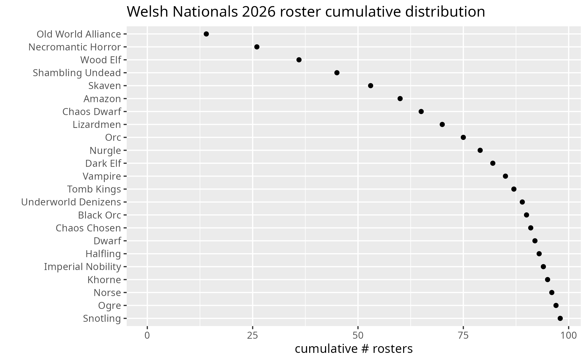

The top 10 races at the Welsh Nationals come as no surprise after our [previous blog post](https://bbscholar.netlify.app/post/first-bb2025-tournaments/), it largely reflects the general patterns in race popularity at NAF tournaments. 

We will now have a look at the top 11 most popular races (OWA up to Dark Elf), plus Tomb Kings because I want to play them soon. With this selection of races, we have the full top 20 coaches covered, except for Underworld Denizens. A roster book containing all 98 rosters is available as well.

# 1. Old World Alliance (OWA) rosters

Not only was OWA most popular, it was also most effective, with **first and second place going to OWA teams**. 

What do the rosters look like? I boxed the top four OWA teams.

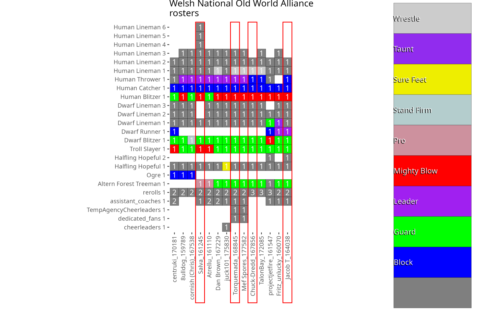
So what do these four rosters have in common: 

* All builds have three rerolls, most by utilizing a **leader** skill on either a human thrower or a dwarf runner. 
* They all favor a **treeman** over an ogre, with Guard or Pro.
* Mighty blow on the human blitzer, which gives the strong **tackle / mighty blow** combo. 
* **Block on the S3 catcher**
* **Guard** on the dwarf blitzer and troll slayer

# 2. Necromantic Horror rosters

Necro gets everything at 1150 + 7SP, so no surprises here. 3 rerolls, all positionals, Four guard, three block was the most common build and also the build that came in highest (6th place, by coach camelchops).

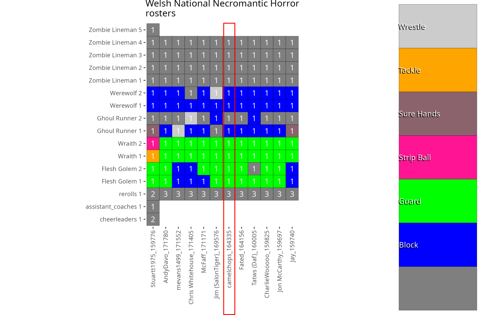
Only variation is some coaches putting block on flesh golems.

# 3. Wood Elves rosters

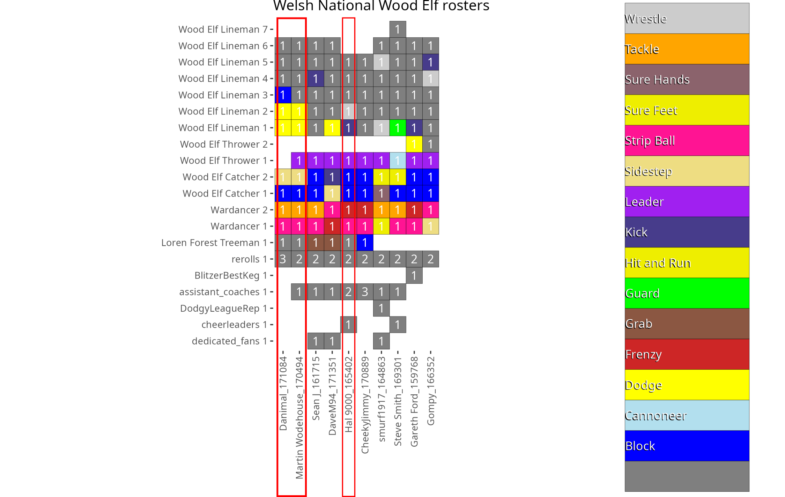

Here the choice is bringing a **tree** or not. Best scoring coaches all brought a tree. Comparing with my last [roster analysis three years ago done on EB2023 ruleset rosters](https://bbscholar.netlify.app/post/blood-bowl-eurobowl-rosters/), we see that the classic top Wood Elf roster is:

* giving war dancers **tackle** and **strip ball**, 
* a **tree**, 
* **3 rerolls** (either with or without leader caddy) and 
* putting **dodge and/or wrestle** on the linemen.

It appears this has not changed in Third Season.

What is new that the two catchers get skills, **sidestep** and **block**. Perhaps because block (and sidestep indirectly) offers a bit more protection for the catchers when only two can be fielded?

# 4. Shambling Undead rosters

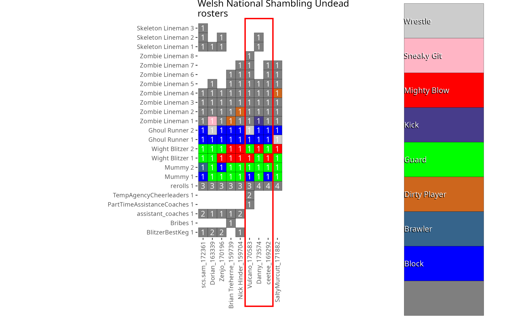
Top performing coaches went for two builds:

* three rerolls and 14 players, 
* or four rerolls with 13 players. 

Skill wise: Either guard mummy or spending two SP for a block mummy. Guard and mighty blow wights. Block Ghouls.

# 5. Skaven rosters

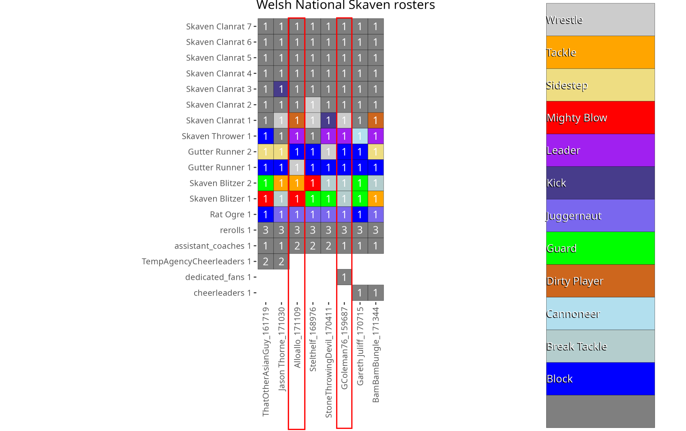
To my surprise, NO variation in team player composition. All coaches went for roger, two gutters, two blitzers, one thrower and 7 linerats. For a total of 13 players. Leader on the thrower. 

The top coach went for a really interesting build, putting **break tackle** on both (S3) blitzers, giving these a +1 on their dodges, making these pieces more similar to a gutter runner. 

# 6. Amazon rosters

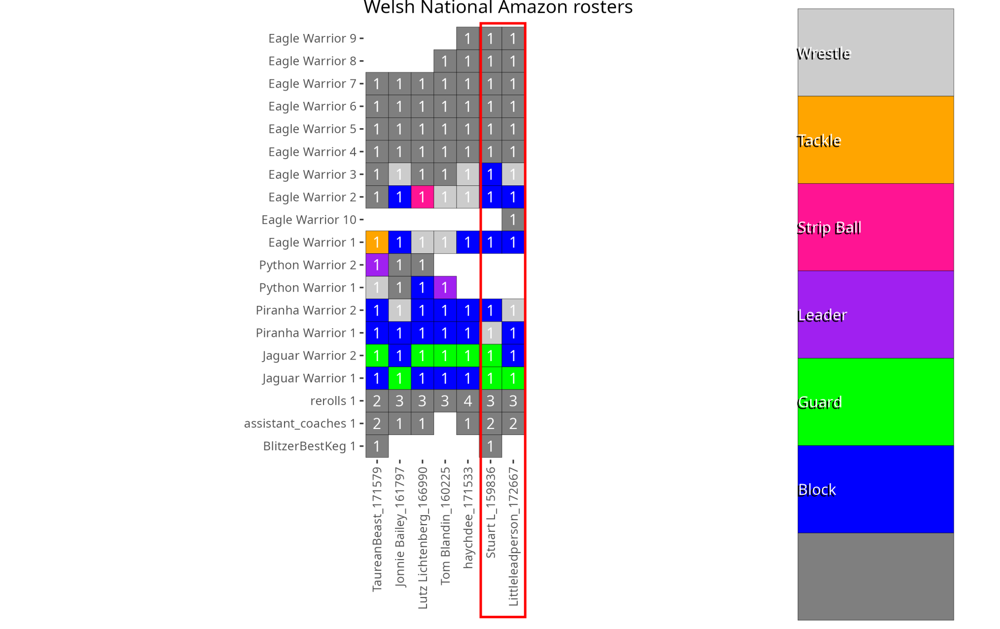
For amazon quite some variation, with either zero, one or two throwers, but the top performers both went for the standard roster: 

* 3 rerolls
* No throwers
* two blitzers, one block / one wrestle, 
* two blockers, one had the two guard build, the other the block/guard build. 
* Complemented with either 9 + keg or 10 linewomen and maxed on the elite skill block.

# 7. Chaos Dwarf Rosters

The chaos Dwarves were popular, but did not perform too well at the Welsh Nationals tournament. So I refrained from singling out a particular build or roster, and we just have a look at the variation here. And there is plenty of that. Either with or without mino, with or without stabba's, with or without flamesmiths. 

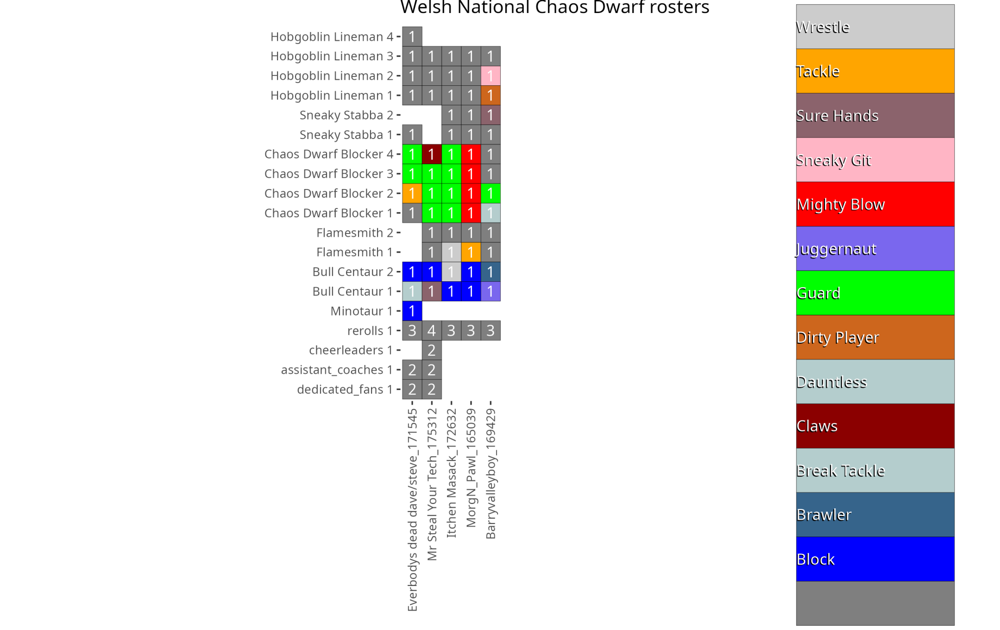

# 8. Lizardmen rosters

Lizardmen are also interesting to have a look at. They were a popular choice, and at least one coach made into a shared fourth place on Match Points (WDL 4/1/1) so they did perform as well.

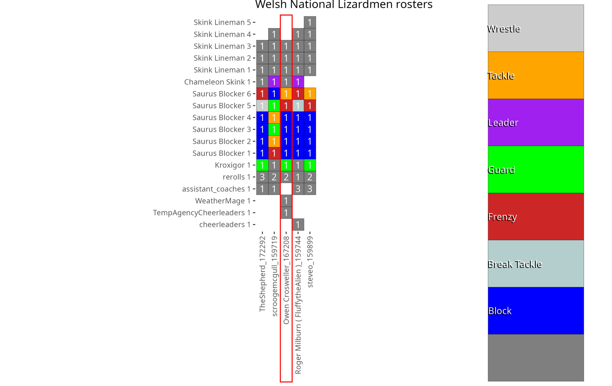
With Block as an Elite skill maxed at 4, and Saurusses gaining Juggernaut, giving one saurus Frenzy is the obvious choice, creating a semi reliable frenzy blitz piece. Rounded of with 2 rr, a Guard kroxigor, and a tackle Saurus.

# 9. Orc Rosters

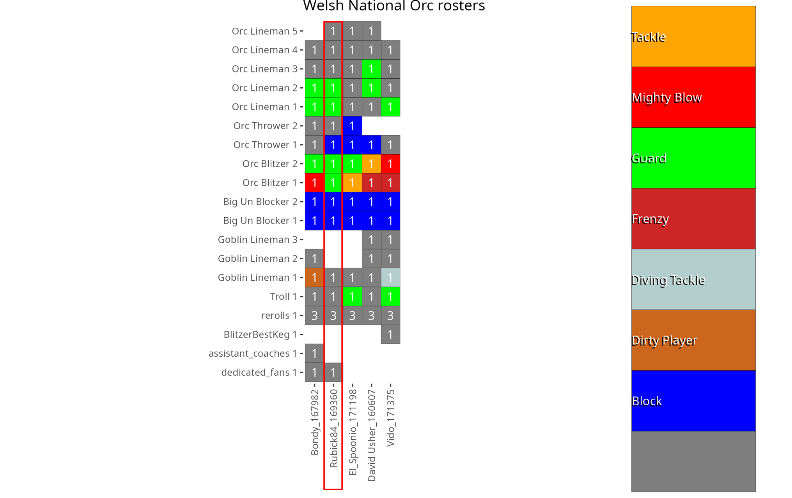
Orcs took third place, so let's have a look at that roster.
New in Third Season is Orc linemen having strength access on a primary.

The top performing Orc coach went for:

* 3 rerolls, 
* Troll, 
* goblin, 
* all positionals 
* 5 linemen, of which two guard.

With respect to skill choice, both block and guard are popular: 

* **Block** on the big uns, that come with mighty blow standard, 
* two **guard** blitzers that now come with block and break tackle.

# 10. Nurgle rosters

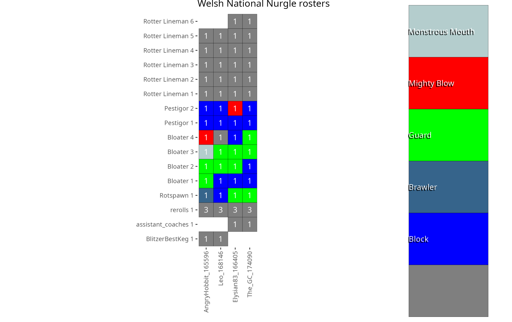
As with Chaos Dwarves, no Nurgle roster ended up in the top 20, so no highlighting of particular builds, we just have a look at roster variation. 

There were a lot of similarities in the rosters:

* 3 rerolls
* Full positionals: rotspawn, 4 bloaters and two pestigors, with either 5 (+ keg) or 6 rotters for a roster of 12 or 13 players

Skill wise, a lot of block and guard. 

One coach went for the new **Monstrous Mouth** mutation skill, that allows players to " Chomp" other players on a 3+. A "Chomped"  player cannot move while being chomped. Curious how effective this new skill will turn out to be!

# 11. Dark elf rosters

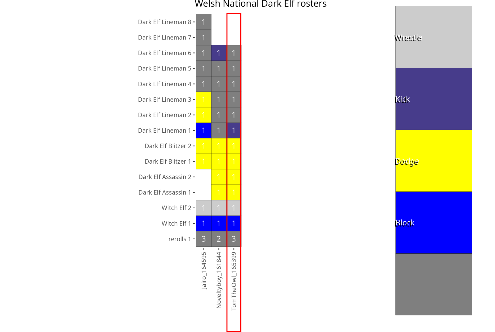

A dark Elf roster took fourth place, which is interesting, because Dark Elves are generally considered to have taken a nerf with the loss of two blitzers.  
So what rosters do we have?

First off all, it is noteworthy that no coach took any **Runners**. Not even as a leader caddy, their traditional use at tourneys. 

In contrast, two out of three rosters took two Assassins. 
Let's compare the two positionals:

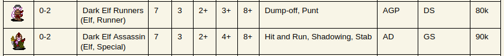

They have equal stat lines, except for passing (3+ vs 4+), similar cost (80 vs 90K) but differ greatly in their skills, and skill access (with Assassins not having primary access to general skills). 

The Runner comes with two skills, **Dump-off** and **Punt**. **Punt** is a new skill that allows for a completely new action where a player (that is in possession of the ball) can kick the ball D6 squares down the field (after which it needs to be secured again). I doubt whether such an uncontrolled action (both direction and distance are random) would often be useful.

An Assassin comes with three skills: **Hit and Run**, **Stab** (which make a nice combo, stabbing and then escaping to safety after the deed), and **Shadowing** that now always succeeds on a 4+. 

My preliminary conclusion is that its a clear win for the assassin here.

Back to the top roster: That roster went for full positionals except the runners, 6 linemen for a team of 12 players, and 3 rr. No apothecary.

From the Tourplay data, we can see that the assassins made more than half of the touchdowns. This might be related to the **Hit and Run** skill, as the free movement after a block or stab action helps break through a line of defense.

Finally, a surprising choice is having **Kick** on the roster. Not something I have seen before on tournament Dark Elf rosters, curious about the motivation for doing so.


# Bonus: Tomb Kings rosters

Finally, we also have a look at Tomb Kings, because this will be my next league team, and up and coming coach *Blitzy* chose Tomb Kings for this tournament. *Blitzy* is a Blood Bowl phenomenon who won three Blood Bowl tournaments last year, including Thrudball 2025, with Chaos Dwarf and Nurgle, so he must obviously know what is good :)

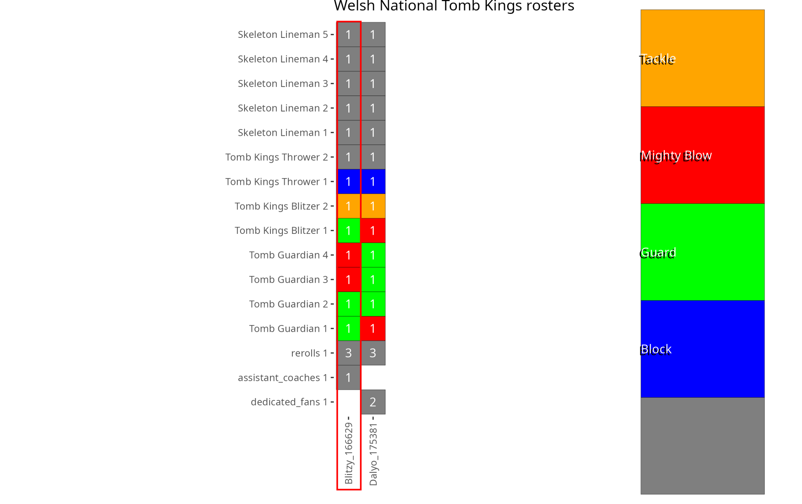

No surprises there: 

* all positionals, 
* 6 skellies for a roster of 12 players, 
* 3 rr

Regarding skill choice: a 50/50 mix of **Mighty Blow** and **Guard** for the tomb guardians, a **guard** blitzer and a **tackle** blitzer, topped off with a **block** thrower.

# To conclude

A rosterbook containing all 98 rosters was made with the R package `bbrosterplots` and is available as a PDF at [](insert_url_here).


