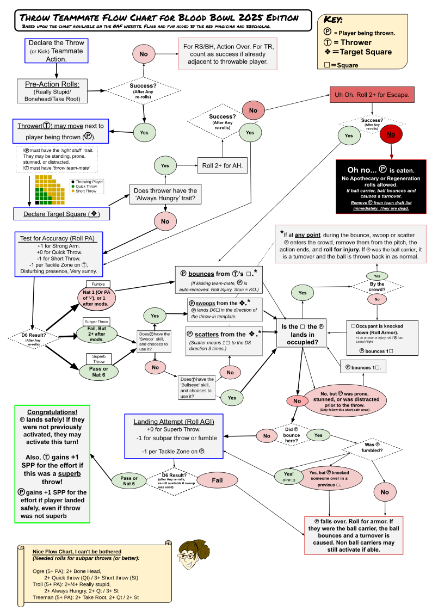

Blood Bowl Third Season (aka BB2025) is here! 

In this post, I look at the changes in Throw Teammate and use that to update my favorite Throw Teammate (TTM) Flowchart. There are several, dare I say, many flowcharts for TTM out there. The most important one is the one provided by the NAF, because that has been meticulously verified by rules laywers and many eyes from the community. 

But my personal favorite is the [flowchart made by the Red Magician for BB2020](https://theredmagician.wordpress.com/2020/10/23/blood-bowl-2020-throw-team-mate-flow-chart-questions/). I found it a few years ago in [a Reddit post](https://www.reddit.com/r/bloodbowl/comments/jfsvdb/updated_throw_team_mate_chart_for_bb_2020/). 

I like it because for me it has the right balance between compressing some things (such as the Throwing player either being an Ogre, Troll or Tree), but being comprehensive in other things, such as what happens when a thrown player bounces off another player on the field. Also I like the layout, having a large font size and designed to cram everything on a single A4 page that can be printed and laminated. As a result it might come a across a bit messy, we can't have it all.

With the new edition, I contacted the mysterious Red Magician (who replied promptly!) and obtained the source file (a Google Drawing) and his permission to update and share the flowchart. I converted the Google Drawing into a SVG file with embedded fonts that can be edited with Inkscape, an Open Source vector graphics editor, and exported to PDF.

So what's new? I used as a reference the NAF version, as reviewed and discussed on Reddit [here](https://www.reddit.com/r/bloodbowl/comments/1pidinu/updated_throw_teammate_flowchart/). Changes to TTM involve the outcomes of the Throw, i.e. no more terrible or successful throw, now we have "subpar throw". I also added in the effects of new skills such as **Bullseye** and **Lethal Flight**, and gave the buffed **Swoop** skill a more prominent position, as it is likely to become standard on Goblin teams.

Without further ado, here it is:

# Download section

The updated Throw Teammate Flowchart for BB2025 can be downloaded [here](/post/throw_teammate_flowchart/ttm/TTM Chart for BB2025.pdf) and the SVG source is available [here](/post/throw_teammate_flowchart/ttm/TTM Chart for BB2025.svg) if you want to tinker with it.

Note, the text could only be exported as paths (i.e. vector shapes, curse you Google!), the SVG is now a mix of editable text and vector shapes. Be warned!

