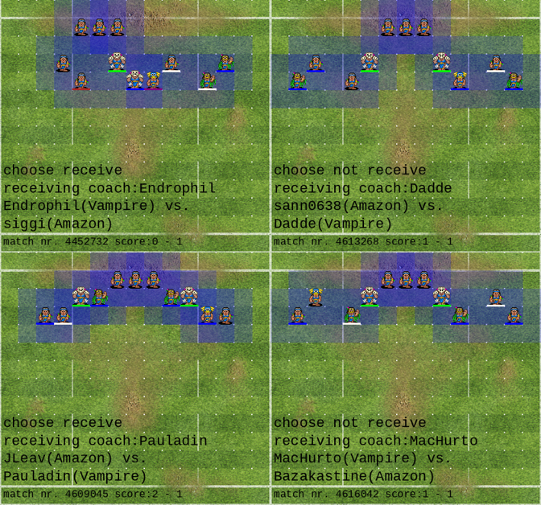

<script src="https://cdnjs.cloudflare.com/ajax/libs/require.js/2.3.6/require.min.js" integrity="sha512-c3Nl8+7g4LMSTdrm621y7kf9v3SDPnhxLNhcjFJbKECVnmZHTdo+IRO05sNLTH/D3vA6u1X32ehoLC7WFVdheg==" crossorigin="anonymous"></script>
<script src="https://cdnjs.cloudflare.com/ajax/libs/jquery/3.5.1/jquery.min.js" integrity="sha512-bLT0Qm9VnAYZDflyKcBaQ2gg0hSYNQrJ8RilYldYQ1FxQYoCLtUjuuRuZo+fjqhx/qtq/1itJ0C2ejDxltZVFg==" crossorigin="anonymous" data-relocate-top="true"></script>
<script type="application/javascript">define('jquery', [],function() {return window.jQuery;})</script>


This blog post describes a possible use case of the `fumbbl_replays` package.

To install the `fumbbl_replays` python package, follow the [instructions on Github](https://github.com/gsverhoeven/fumbbl_replays).

<!--Render process: Quarto met raw YAML cell naar hugo-md. ignore files toevoegen. Daarna gewoon in R Blogdown runnen? -->

``` python
#%pip install .

#   html:
    #code-fold: true
    #self-contained: false
```

The idea is to analyze real world defensive setups in a tournament setting.
I am currently playing Amazons in our local league. Next is to play them in a tournament.
So lets look at setups that field an WC23/EB25 style Amazon roster, and learn from the best.

To learn from the best, we need to find high stakes tournament games with EB/WC rosters on FUMBBL.
Both the Tilean Team Cup (NAF organized, World cup 2023 ruleset) and Super League Season 6 (Eurobowl 2025 ruleset) checks these boxes.

The Tilean Team Cup tournament was even blogged about by NAF tournament director Stimme, who wrote:

https://www.thenaf.net/2023/05/tournament-director-blog-may-2023/

*Among the individual coaches, Siggi stood out with his Amazons, earning the title of best coach with a flawless record of six wins.*

``` python
import fumbbl_replays as fb
import pandas as pd

# list of EB/WC amazon teams by strong coaches
team_ids = [1117702, # siggi
1210795, # jleav
1212630, # mike davies
1215544, # yuri
1216461, # bazakastine
1210794] # tripleskull

match_ids = []

for team_id in team_ids:

    race_name = fb.fetch_team(team_id)['roster']['name']

    json_matches = fb.fetch_team_matches(team_id)

    for i in range(len(json_matches)):
        match_ids.append(json_matches[i]['id'])
```

# The Amazon roster in the WC2023 / EB25 ruleset

First lets have a look at a typical Amazon roster. The roster consists of 13 players:

-   2 Jaguar blockers
-   2 Piranha blitzers
-   a Python thrower
-   and 8 Eagle linemen

The blockers either both have Guard, or one Guard one Block. The blitzers typically have both Block, or one Block one wrestle. On the linewomen more Block and Wrestle.
3 rerolls finish the roster.

``` python
my_replay = fb.fetch_replay(match_id = max(match_ids))
players = fb.extract_players_from_replay(my_replay)
rosters = fb.extract_rosters_from_replay(my_replay) 

(rosters
 .query('race == @race_name')
 .filter(['race' , 'short_name', 'positionName',  'skillArrayRoster', 'learned_skills'])
)
```

<div>
<style scoped>
    .dataframe tbody tr th:only-of-type {
        vertical-align: middle;
    }

    .dataframe tbody tr th {
        vertical-align: top;
    }

    .dataframe thead th {
        text-align: right;
    }
</style>

|  | race | short_name | positionName | skillArrayRoster | learned_skills |
|----|----|----|----|----|----|
| 0 | Amazon | B1 | Jaguar Warrior Blocker | \[Defensive, Dodge\] | \[Guard\] |
| 1 | Amazon | B2 | Jaguar Warrior Blocker | \[Defensive, Dodge\] | \[Guard\] |
| 2 | Amazon | Z1 | Piranha Warrior Blitzer | \[Dodge, Hit And Run, Jump Up\] | \[Block\] |
| 3 | Amazon | Z2 | Piranha Warrior Blitzer | \[Dodge, Hit And Run, Jump Up\] | \[Wrestle\] |
| 4 | Amazon | T1 | Python Warrior Thrower | \[Dodge, On The Ball, Pass, Safe Pass\] | \[\] |
| 5 | Amazon | L1 | Eagle Warrior Linewoman | \[Dodge\] | \[Block\] |
| 6 | Amazon | L2 | Eagle Warrior Linewoman | \[Dodge\] | \[Block\] |
| 7 | Amazon | L3 | Eagle Warrior Linewoman | \[Dodge\] | \[Wrestle\] |
| 8 | Amazon | L4 | Eagle Warrior Linewoman | \[Dodge\] | \[\] |
| 9 | Amazon | L5 | Eagle Warrior Linewoman | \[Dodge\] | \[\] |
| 10 | Amazon | L6 | Eagle Warrior Linewoman | \[Dodge\] | \[\] |
| 11 | Amazon | L7 | Eagle Warrior Linewoman | \[Dodge\] | \[\] |
| 12 | Amazon | L8 | Eagle Warrior Linewoman | \[Dodge\] | \[\] |

</div>

# Defensive setups: standing on the shoulders of giants

AndyDavo has a [Defensive setup guide](https://www.youtube.com/watch?v=hV7brp8B7K4) on Youtube.
Here he takes a generic approach to thinking about Defensive setups, sometimes talking about agility, or hybrid or bash teams.

JackassRampant / Matt Slater wrote an [awesome series of articles on FUMBBL](https://fumbbl.com/p/notes?op=view&id=9773) discussing defensive setups and presenting a comprehensive taxonomy, formalizing the study of defensive setups. True Blood Bowl scholarship!

An [older FUMBBL resource](https://fumbbl.com/help:Defensive+Setups) exists as well, with links to the Talk Fantasy Football forum website. this is interesting as we can trace discussions all the way back to the early 2000s, when the first attempts at collecting and naming defensive setups were made, and terms like "Chevron", "Ziggurat" and "The boat" were coined.

# Defensive setups in theory: "it depends"

Before we zoom in on Amazon tournament setups, let me summarize what I learned from the resources above.

A defensive setup can be thought of as a balance between four goals:

-   Protecting the players on the line of scrimmage
-   Protecting valuable positional players
-   Spatial control
-   Responsiveness

As JackassRampant writes: "It's important to note that all these defenses are used in practice, at least occasionally. There's very little "theorybowl" in this series: I have used or seen every single defense presented here, and while some of them are more broadly applicable than others, all have their place."

So let's look at the best practice! As different races differ in agility, bashing power, fouling power etc, it makes sense to stratify by matchup.
I decided to select six top coaches playing amazons in the Super League S6 or Tilean Team Cup 2023, resulting in 6 x 7 = 42 matches.

# Plotting the defensive setups used

``` python
do_refresh = False

replay_ids = []
race_defense = []
race_offense = []

for match_id in match_ids:
    print(".", end = '')
    # fetch and parse replay (positions contains board state at kick-off)
    match_id, replay_id, positions, receiving_team, metadata = fb.fetch_data(match_id)
    # create plots
    plot = fb.create_defense_plot(replay_id, match_id, positions, receiving_team, text = metadata, refresh = do_refresh) 
    plot = fb.create_offense_plot(replay_id, match_id, positions, receiving_team, text = [], refresh = do_refresh) 

    replay_ids.append(int(replay_id))
    race_defense.append(metadata[4])
    race_offense.append(metadata[5])

df_replays = pd.DataFrame( {"matchId": match_ids,
                            "replayId": replay_ids,
                            "raceOffense": race_offense,
                            "raceDefense": race_defense
                            })
```

    .........................................

So we have a set of 42 high stakes Amazon matches. Let's see how many of those start with Amazon's defending:

``` python
len((df_replays
 .query('raceDefense == "Amazon"')))
```

    28

So about 2/3 of them start with Amazons setting up first.
As setting up against a slow bash team is (presumably) different, let's pick a few of the most common opposing races.

The most common are:

``` python
(df_replays
 .query('raceDefense == "Amazon"')
 .groupby(['raceOffense'], as_index=False)
 .agg({'raceDefense': 'count'})
 .sort_values('raceDefense',ascending = False)
 .query('raceDefense > 1')
)
```

<div>
<style scoped>
    .dataframe tbody tr th:only-of-type {
        vertical-align: middle;
    }

    .dataframe tbody tr th {
        vertical-align: top;
    }

    .dataframe thead th {
        text-align: right;
    }
</style>

|     | raceOffense      | raceDefense |
|-----|------------------|-------------|
| 9   | Shambling Undead | 4           |
| 10  | Skaven           | 4           |
| 14  | Vampire          | 4           |
| 0   | Amazon           | 3           |
| 2   | Dwarf            | 3           |

</div>

# Defending against Shambling Undead

The Shambling Undead team is characterized by two S5 mummies with MV 3, two S3 wight blitzers and typically four ghouls with dodge and block or wrestle.
In EB25 undead is strong because they can put block on the ghouls, guard on the mummies, and generally get everything they want/need.

``` python
im_list = fb.select_images(df_replays, race_name, ['Shambling Undead'])   
fb.make_tiling(im_list, scale = 0.8)
```


Let's try to apply the defensive setup taxonomy. Top left we have **the Boat / Rule of Five**, below left we have the **Chevron**, and on the right we have an assymetric 3-4-4 setup that is not directly recognized (@Matt can you name it?). Interestingly, on the setups on the right, a blitzer is exposed and within blitzing range of a mummy.

Here the defensive recipe is:

-   Put three linewomens without skills on the LOS
-   Do not put players on the second row
-   Put three to four players on row three
-   Put the blockers on row four (to protect against the Mummies with Mighty Blow?)

# Defending against Vampires

Vampires are fast (M8 runners), and strong (S4 block blitzers). Here defending coaches opt for a 3-4-4 wide setup.

Variation is observed in:

-   distance from the sidelines
-   asymmetric or symmetric
-   using the second or third row

``` python
(df_replays
 .query('raceDefense == "Amazon" & raceOffense == "Vampire"'))
```

<div>
<style scoped>
    .dataframe tbody tr th:only-of-type {
        vertical-align: middle;
    }

    .dataframe tbody tr th {
        vertical-align: top;
    }

    .dataframe thead th {
        text-align: right;
    }
</style>

|     | matchId | replayId | raceOffense | raceDefense |
|-----|---------|----------|-------------|-------------|
| 2   | 4452732 | 1612742  | Vampire     | Amazon      |
| 12  | 4609045 | 1794404  | Vampire     | Amazon      |
| 17  | 4613268 | 1799397  | Vampire     | Amazon      |
| 30  | 4616042 | 1802671  | Vampire     | Amazon      |

</div>

``` python
im_list = fb.select_images(df_replays, race_name, ['Vampire'])   
fb.make_tiling(im_list, scale = 0.8)
```



Again applying the taxonomy, we have have top right a **Chevron**, top left a **Bunkers / Fortress** asymmetric variant, right below a **more risky / offensive Chevron**, and below left a setup (not named, @Matt do you recognise this one?) that applies the buddy system, designed to protect the LOS, and is also more risky / offensive.

# Defending against Skaven

Skaven have four fast M9 S2 Gutter Runners, but also pack a punch with two Blitzers and a Block or Juggernaut Rat Ogre.

Here an asymmetric setup is apparently preferred, using a **"rule of four"** protecting the vulnerable positional pieces (Dirty Player, Leader, Guard Blocker).

One setup **(Battleship like)**, by coach Jleav is surprising. It is compact and "offensive" (starting on row 2 instead of 3) . It relies on two S4 Guard Blockers, that each protect two players.

``` python
(df_replays
 .query('raceDefense == "Amazon" & raceOffense == "Skaven"'))
```

<div>
<style scoped>
    .dataframe tbody tr th:only-of-type {
        vertical-align: middle;
    }

    .dataframe tbody tr th {
        vertical-align: top;
    }

    .dataframe thead th {
        text-align: right;
    }
</style>

|     | matchId | replayId | raceOffense | raceDefense |
|-----|---------|----------|-------------|-------------|
| 0   | 4456080 | 1616794  | Skaven      | Amazon      |
| 1   | 4454456 | 1614866  | Skaven      | Amazon      |
| 3   | 4452264 | 1612210  | Skaven      | Amazon      |
| 6   | 4625060 | 1813213  | Skaven      | Amazon      |

</div>

``` python
im_list = fb.select_images(df_replays, race_name, ['Skaven'])   
fb.make_tiling(im_list, scale = 0.8)
```


# Defending against dwarves: bring in the boat!

Here we the famous **"boat"** defensive setup is popular. **AKA the rule of five**. The five "best" players are kept behind a light screen (2 spaces apart) on row three.
Dwarves come with a lot of Tackle and Mighty blow, forming a deadly threat to amazons.

``` python
im_list = fb.select_images(df_replays, race_name, ['Dwarf'])   
fb.make_tiling(im_list, h = 3)
```


# Mirror match! Zons vs Zons

Here we see a lot of variation. 3-5-3, Jleav's compact setup (The Battleship)

``` python
im_list = fb.select_images(df_replays, race_name, ['Amazon'])   
fb.make_tiling(im_list, h = 3)
```


# Summarizing what we have learned

We can break down a setup formation row by row, starting with the Line Of Scrimmage (LOS):

-   For amazons, typically three linewoman without skills are put on the LOS, concentrated together, either centered or with maximum offset.
-   To defend against Quick Snap (where the offense can move x players one square), the line directly behind the scrimmage is often kept empty, except when we think we can outbash our opponent, such as Skaven or Vampires.
-   On the third row, more expendable players are placed, OR players that can take a hit, for example a S4 Blocker (AV9) with Block.
-   Then finally on the fourth row, the high value positionals are placed. For example the blitzers, a thrower with Leader, or a Blocker with Guard.
